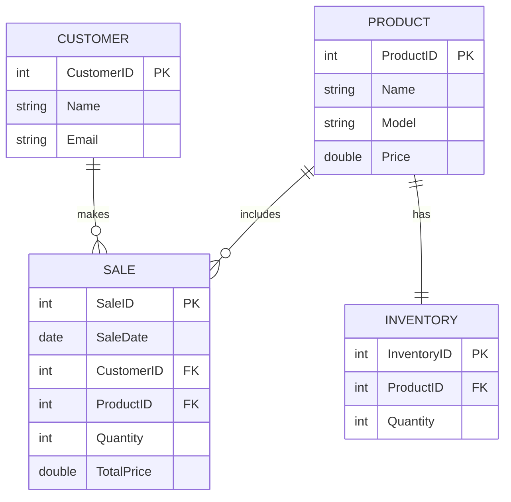

# hachanti.github.io

Name: Hansika Achanti
Email: Hachanti@my.waketech.edu
Description of Account: This is my school account
Description of repository: This repository with hold my assignments

# About Me

## My Interests  
* Badminton
* Art 
## Websites I Recommend
* [Google Slides](https://workspace.google.com/products/slides/): It is a very good website to use to make presentations

# Mermaid Diagrams

### Description
#### The relationship between the Customer and Sale is important to a business because that is what brings the business money. If the customer likes the product, then they will buy it, which causes a sale to happen, which is why this relationship is significant.
#### The relationship between the Sale and Product is important to a business because without the sale, the product would be useless (because it would not bring the business any money). And without the Product the business would not get any money (because it would have nothing to sell). This shows why this relationship is significant.
#### The relationship between the Product and Inventory is important because without knowing how much of the product is there the business would not be able to properly price the items (Supply and Demand). This shows why this relationship is significant.

